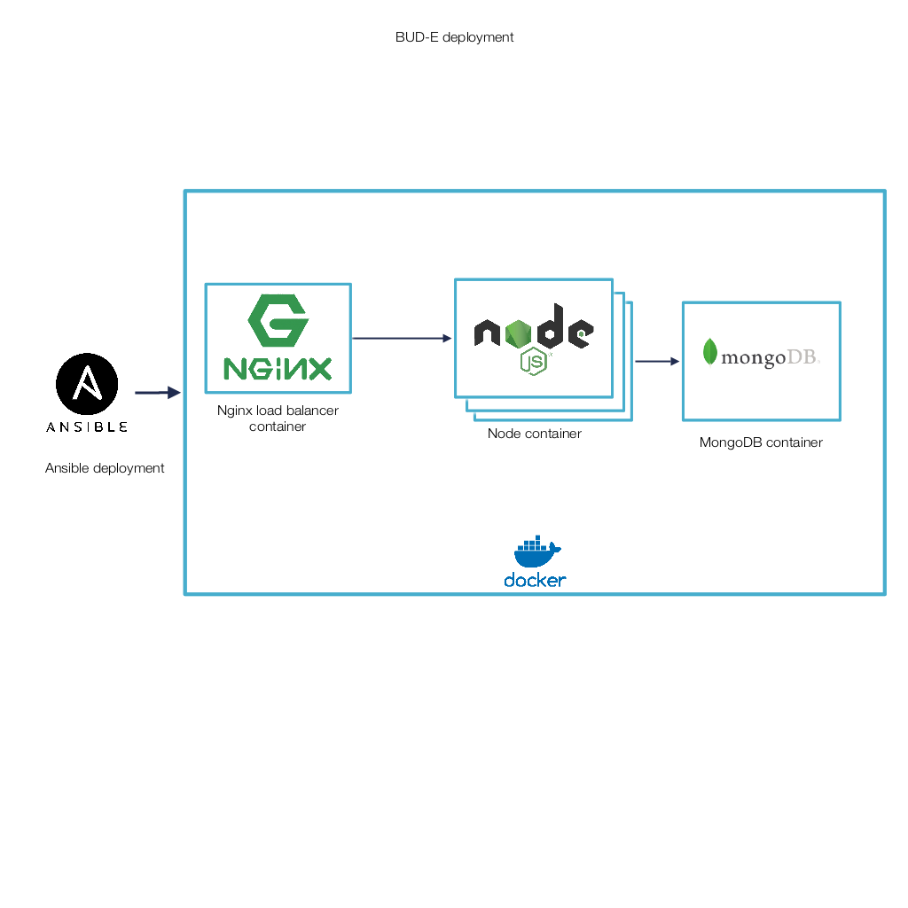

# Ansible script for bud-e-back 
## Deployment diagram 

## Tested version 
- Vagrant 2.0.2
- ansible 2.3.1.0

## Producton environement
Create **hosts** file : 
```
[server]
ip_server ansible_port=22 ansible_ssh_private_key_file=/path/ssh_key
```
And use ansible for provisioning : 
```
ansible-playbook -i hosts main.yml
```
## Dev environement
In folder **/vagrant/ubuntuxenial64**
```
vagrant up
```
Modify **host** file for ansible get ssh key to the vagrant VM :
```
[server]
127.0.0.1 ansible_port=2222 ansible_sudo_user=root ansible_sudo_pass=vagrant ansible_ssh_private_key_file=/home/callot/Projet/ansible/nodejs-ansible/vagrant/ubuntuxenial64/.vagrant/machines/default/virtualbox/private_key
```
And use ansible for provisioning : 
```
ansible-playbook -i hosts main.yml
```
